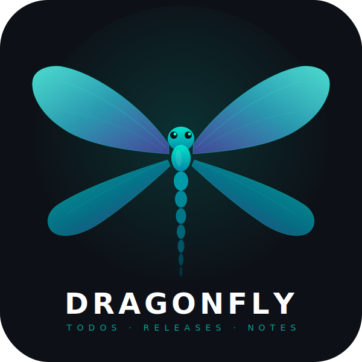
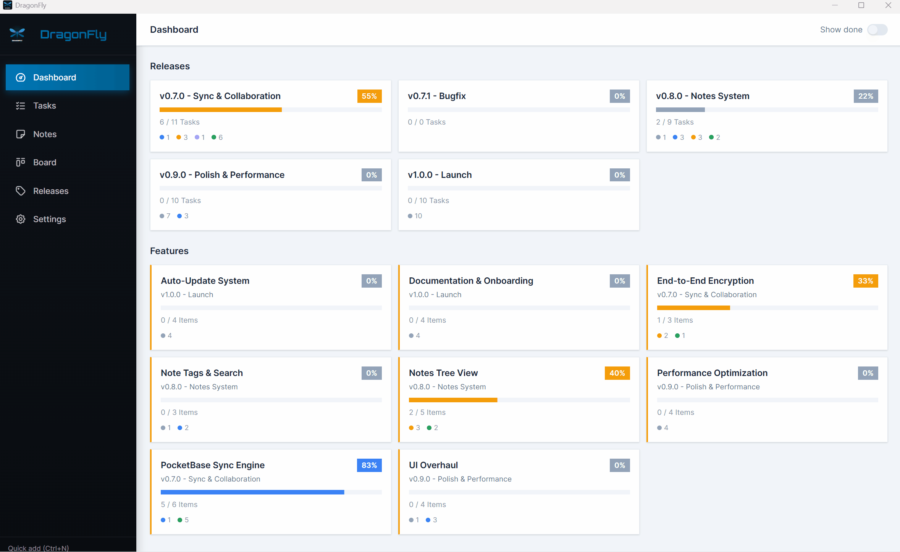
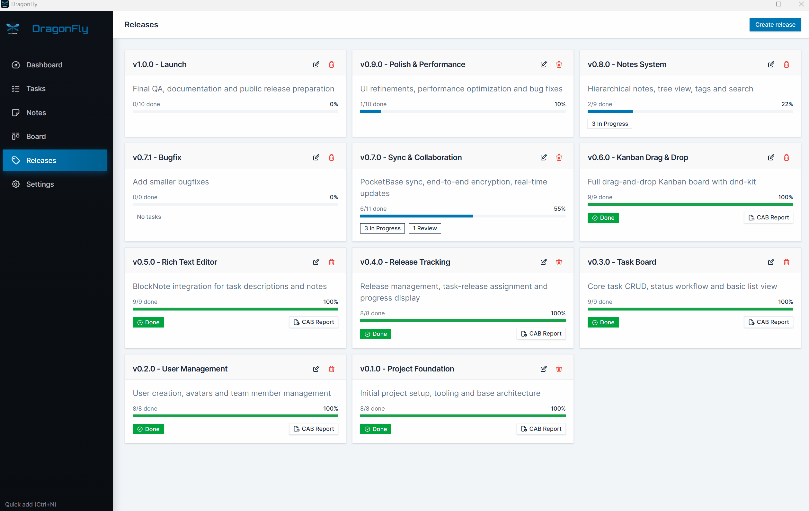
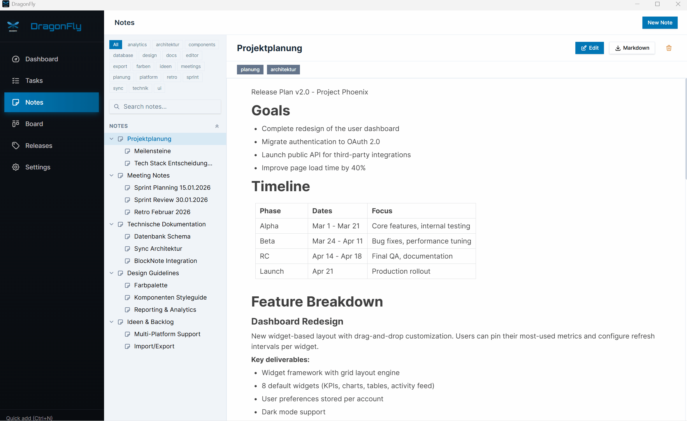

# DragonFly

<div align="center">
  
  <br />
  <strong>A privacy-first, offline-capable project management desktop app</strong>
  <br /><br />

  
  
  
  
  
</div>

---

## What is DragonFly?

DragonFly is an open-source desktop application for personal and team project management. It runs entirely on your machine — no cloud account required, no telemetry, no subscriptions.

**Key characteristics:**
- All data stored locally in SQLite (optionally encrypted with AES)
- Optional PocketBase sync for teams
- Voice transcription via Whisper (runs fully offline)
- Rich text notes with Mermaid diagram support
- Available for Windows and Linux

---

## Features

| Feature | Description |
|---------|-------------|
| **Kanban Board** | Drag & drop task management with customizable columns |
| **Todo List** | Simple task list with due dates and priorities |
| **Rich Notes** | BlockNote-powered editor with Markdown, diagrams (Mermaid), and scratchpads |
| **Reminders** | Time-based reminders with optional email notifications |
| **Voice Input** | Offline speech-to-text transcription via Whisper.cpp |
| **Backups** | One-click ZIP backup of all data and attachments |
| **Encryption** | AES passphrase protection for sensitive data |
| **Sync** | Optional PocketBase-based team sync |
| **i18n** | UI available in 8 languages |

---

## Screenshots

<div align="center">

**Dashboard**


**Kanban Board**


**Tasks**


**Releases**


**Notes**


**Settings**


</div>

---

## Installation

Download the latest release for your platform from the [Releases page](https://github.com/limoza-dragonfly/dragonfly/releases).

| Platform | Format |
|----------|--------|
| Windows | `.msi` (installer), `.exe` (NSIS), portable `.zip` |
| Linux | `.deb`, `.rpm`, `.AppImage` |

### Build from source

See [docs/building.md](docs/building.md) for full build instructions, including a Docker-based build that requires no local toolchain installation.

**Quick start (requires Node.js 20+, Rust stable, CMake):**

```bash
git clone https://github.com/limoza-dragonfly/dragonfly.git
cd dragonfly
npm install
npm run dev:tauri
```

---

## Tech Stack

| Layer | Technology |
|-------|-----------|
| Frontend | React 19 + TypeScript + Vite |
| UI | Tailwind CSS + Shadcn/ui + Radix UI |
| Editor | BlockNote |
| State | Zustand |
| Backend | Tauri v2 (Rust) |
| Database | SQLite via tauri-plugin-sql |
| Voice | Whisper.cpp via whisper-rs |
| Email | Lettre (SMTP) |

---

## Contributing

Contributions are welcome! Please read [CONTRIBUTING.md](CONTRIBUTING.md) before opening a pull request.

- [Report a bug](.github/ISSUE_TEMPLATE/bug_report.yml)
- [Request a feature](.github/ISSUE_TEMPLATE/feature_request.yml)
- [Read the architecture docs](docs/architecture.md)

---

## Security

Found a vulnerability? Please read our [Security Policy](SECURITY.md) before disclosing publicly.

---

## License

This project is licensed under the terms in [LICENSE](LICENSE).

Third-party licenses are listed in [THIRD_PARTY_LICENSES](THIRD_PARTY_LICENSES).
